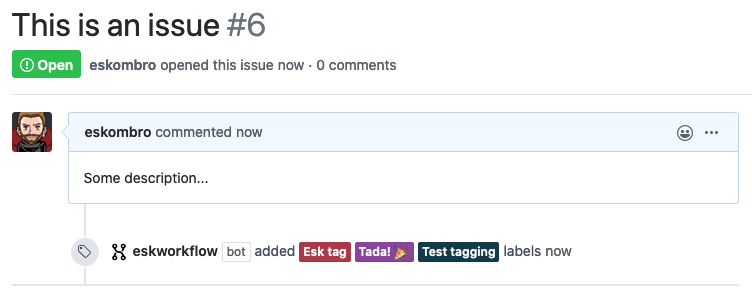

# workflowbot

> A GitHub App built with [Probot](https://github.com/probot/probot) for team workflow made with Probot

# Configuration file

Create a directory `.github` in the root of your repo (if it doesn't exist) and add a file named `eskworkflow.yaml`.  

## Add automatic tags for new issues on the repo

Example:

```yaml
auto_add_labels: 
  - name: "Esk tag"
    color: "aa3a4a"
  - name: "Test tagging"
    color: "123a4a"
  - name: "Tada! :tada:"
    color: "884599"
```



# WIP: Automatic workflow on a project

```yaml
repo_project_workflow:
  - name: "My project"
  - columns:
    - column:
      - name: "open"
      - tags: "New issue"
    - column:
      - name: "assigned"
      - tags: "Assigned"
    - column:
      - name: "closed"
      - tags: "Closed"
```

## Contributing

If you have suggestions for how workflowbot could be improved, or want to report a bug, open an issue! We'd love all and any contributions.

For more, check out the [Contributing Guide](CONTRIBUTING.md).

## License

[ISC](LICENSE) © 2020 Samuel Jimenez <sjimenezre@gmail.com>
