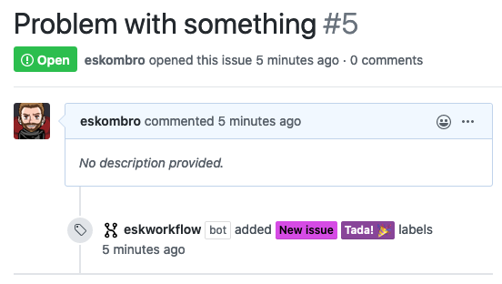
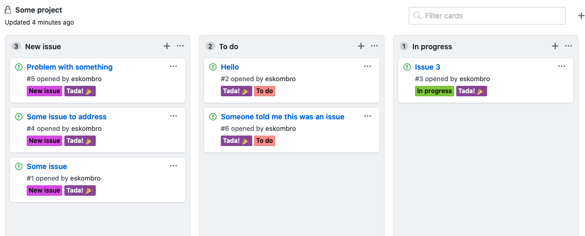
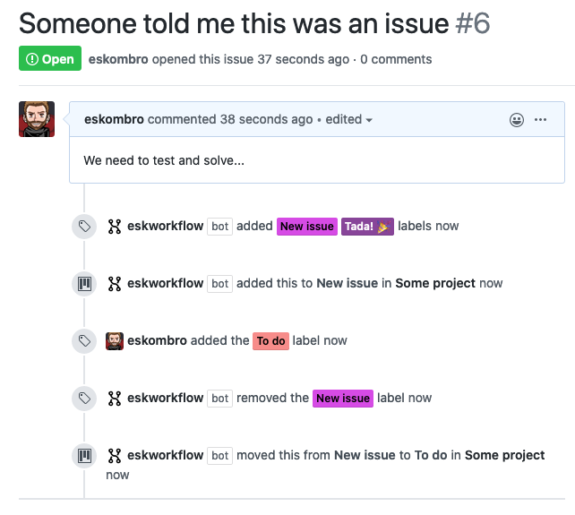

# EskWorkflow

> A GitHub App for team workflow (built with [Probot](https://github.com/probot/probot)).

# Activate EskWorkflow in your own project

1. Go to [EskWorkflow GitHub](https://github.com/apps/eskworkflow/) page, click on `Install`, and select the repository / user / organization you want to install it on.

2. Inside the repository where you want to use EskWorflow, create a directory named `.github` in the root of your repo (if it doesn't exist already), and add a file named `eskworkflow.yaml`. This file will content your custom configuration for EskWorkflow in a very simple YAML format.

## Add automatic tags for new issues on the repo

Inside your configuration file (`/.github/eskworkflow.yaml`) add the `auto_add_labels` configuration.

### Example:

```yaml
auto_add_labels: 
  - name: "New issue"
    color: "336699"
  - name: "Tada! :tada:"
    color: "663399"
```

Each label that you define will be autmatically added to every new issue you create on your repository.



## Automatic workflow on a project (based on GitHub labels)

Inside your configuration file (`/.github/eskworkflow.yaml`) add the `repo_project_workflow` configuration.

### Example:

```yaml
repo_project_workflow:
  - name: "Some project"
  - columns:
    - column:
      - name: "New issue"
      - labels:
        - name: "New issue"
          color: "336699"
    - column:
      - name: "To do"
      - labels:
        - name: "To do"
          color: "669933"
        - name: "Reopened issue"
          color: "339966"
    - column:
      - name: "In progress"
      - labels:
        - name: "In progress"
          color: "996633"
    - column:
      - name: "Done"
      - labels:
        - name: "Done"
          color: "993366"
```

After setting up this configuration file:

1. Go to your github repository, and click on the `Projects` tab.
2. Click on `Create a new project`.
3. Use the same project name that you defined in your configuration file (in this case `Some project`). And no template.
4. The project will be set up automatically :tada:

Now you just need to use the labels you set in your configuration to tag your issues, and the board will be updated automatically everytime a label is modified.

### Project example



### Issue labeling and automatic workflow



# Contributing

If you have suggestions for how eskworkflow could be improved, or want to report a bug, open an issue! We'd love all and any contributions.

For more, check out the [Contributing Guide](CONTRIBUTING.md).

## License

[ISC](LICENSE) © 2020 Samuel Jimenez <sjimenezre@gmail.com>
